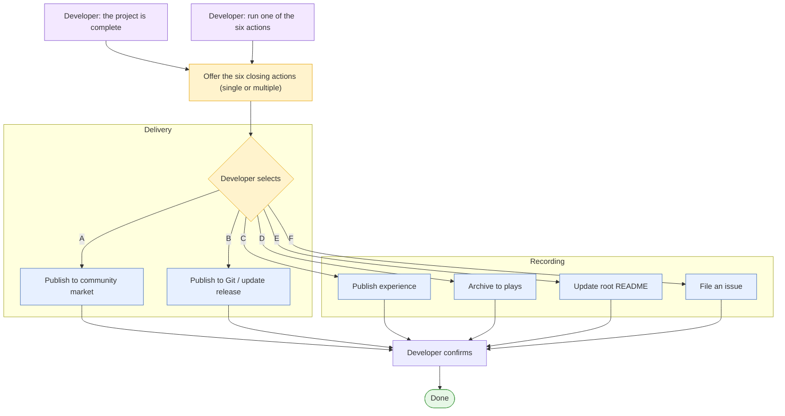

  <a href="project-completion.zh_CN.md">简体中文</a> · <strong>English</strong>

# Project Completion

When development on a project is finished, the completion flow offers a menu of
six optional closing actions. This page is the single authoritative index: it
describes the trigger, the six actions grouped by purpose, the shared safety and
consent gates, and the shared publish profile.

The completion flow is not a fixed pipeline and is not tied to a release. The
developer selects any one or a combination of the six actions, in any order. Each
action runs only after the developer confirms it.

All six actions are **optional** — none is mandatory. The README update (action
E) is one of the six; it runs when selected, and it also accompanies archiving
(action D) by default, so archiving a project also refreshes the README.

## When the completion flow is offered

Offer the six-action menu when either signal occurs:

- The developer says the project is complete (development is done).
- The developer asks to run any one of the six actions directly.

In both cases, remind the developer that the following six closing actions are
available, each selectable on its own or with others.

## The six actions

The actions are grouped by purpose. Delivery actions publish the result of the
project; recording actions capture documentation and open collaboration.

### Delivery

| ID | Action | Detail |
| --- | --- | --- |
| A | Publish to the community market | [Action A](#action-a) |
| B | Publish to Git and update the release | [Action B](#action-b) |

### Recording

| ID | Action | Detail |
| --- | --- | --- |
| C | Publish experience | [Action C](#action-c) |
| D | Archive the application to plays | [Action D](#action-d) |
| E | Update the root README | [Action E](#action-e) |
| F | File an issue | [Action F](#action-f) |

Each action names the repository skill or authoritative document that drives it.
The skills are not rewritten here; the action sections reference them.

## Trigger flow

## Published profile

Publishing to the community collects a set of project attributes. Keep these as
a shared profile so actions C, D, E, and F can reuse the same values instead of
collecting them again:

- Application name (lowercase-kebab-case).
- Bilingual publish title and description.
- Cover image (`<app-name>-cover.<webp|png|jpg>`, up to 10 MiB).
- Source address: the HTTPS Git page the developer submitted, resolved from
  `git remote -v`.
- Firmware path / merged `.bin`.

At execution, reuse the profile where it was already collected. If the profile
was not collected, fetch the values through the relevant action skill.

## Post-release hardware verification

When a delivery action (A or B) produced a merged full build, verify it on real
hardware before treating the project as complete. Download the release's merged
full firmware (`FoloToy-AI-Passport-full.bin`, the flashable complete build from
`0x0`), flash it to a device, and confirm it runs normally. Do not treat a
successful build or upload as hardware validation: this step proves the artifact
the release actually points to boots and works on real hardware. The artifact
comes from the release assets (the CI/CD `full.bin`) or, for a Git release with
no CI artifact, the local `full.bin` the developer built. If it does not run,
stop and fix before closing out. See
[`CI-build-and-release.md`](../ci/CI-build-and-release.md) for the artifact and
flashing.

## Shared safety and consent gates

Every action follows the same non-negotiable rules:

- Confirm consent before starting; this work touches project-private content.
- Confirm a GitHub channel (GitHub MCP, a GitHub skill, or `gh`) before any
  submission; if none is available, generate content for manual pasting and stop.
- Do not submit (issue or PR) until the developer has reviewed and authorized it.
- Do not commit on or modify the developer's current branch; carry the change on a
  dedicated branch or worktree.
- Never include credentials, device QR secrets, private device links, personal
  data, or unsanitized logs.

## Action A: Publish to the Community Market

This action releases the firmware to the AI Passport community market. The
workflow is driven by the official publisher skill. Running the prompt once makes
the assistant install the skill from the official bundle; nothing is committed
into the repository.

### Inputs

- A single merged ESP `.bin` flashed from `0x0`, built and verified with
  `./tools/validate.sh --firmware` (this produces and verifies the merged full
  image; do not substitute `idf.py build`, which is only for day-to-day
  incremental compilation).
- A representative cover image (JPEG / PNG / WebP, up to 10 MiB).
- The public HTTPS Git page for the firmware repository, resolved from
  `git remote -v`.

### Output

These values form the [published profile](#published-profile) that the other
closing actions reuse:

- Application name.
- Bilingual publish title and description.
- Cover image.
- Source address.

### Steps

1. Install the publisher skill from the official bundle.
2. Inspect the project and prepare the bilingual title and description.
3. Resolve the HTTPS Git source.
4. Prepare and validate the cover.
5. Authorize through the official site.
6. Preview every field and obtain explicit approval before uploading.
7. Upload and report the response.

### Safety and boundaries

- Upload only to `https://ai-passport.folotoy.cn`. Publishing and updating are
  external mutations.
- Validation, drafting, and preview that is not confirmed by the developer does
  not authorize upload.
- The assistant never requests, receives, or stores authorization credentials.
- Never retry a rejected upload automatically; report the response and resolve
  the cause with the developer first.

Related: [community publishing reference](publish-to-community.md).

## Action B: Publish to Git and Update the Release

This action publishes the firmware or code to a version-controlled repository and,
when intended, updates the GitHub/GitLab release. This is the Git publishing path,
not the community path — confirm the destination first.

Each step is an external, authorizing mutation. Confirm each one with the
developer separately — do not treat a single up-front confirmation as covering
commit, push, tag, and release.

### Steps

1. Commit the change and push it to the fork (`origin`) — confirm separately.
2. Create and push a tag to trigger the release workflow — confirm separately.
3. Let the tagged build produce the merged firmware `.bin`.
4. Create or update the GitHub/GitLab release with the artifact — confirm
   separately. The workflow sets the default release title to the version/tag
   name; after the release is up, refine it to the project feature name plus the
   version number.
5. Write release notes in English (and a Simplified Chinese version where the
   project is bilingual) covering what is new, how to build, and how to use.
6. Verify the released full build on hardware (see
   [Post-release hardware verification](#post-release-hardware-verification)).

### Rules

- Follow the repository commit and pull-request rules
  ([commit-and-pr.md](../../contribution/commit-and-pr.md)).
- Follow the fork workflow ([fork-guide.md](../../fork-guide.md)).
- A tag-triggered build runs `build-firmware.yml`, which publishes the release
  only for a tag. See [CI-build-and-release.md](../ci/CI-build-and-release.md).
- For day-to-day compilation prefer `idf.py build` (fast, incremental); use
  `./tools/validate.sh --firmware` only when the merged, byte-verified `0x0`
  full image is needed, such as before a release or delivery.
- The workflow creates the release with a default title of the version/tag name
  (from `softprops/action-gh-release` and `github.ref_name`). After the release
  is published, refine the title to the project feature name plus the version
  number — for example `Voice Keychain v1.2.0`. The version is the tag, and the
  feature name is the application's publish name from the shared
  [publish profile](#published-profile).
- Release notes must explain the build to a user who has not read the
  repository: what is new, how to build, and how to use.

Related: [tagged firmware builds and releases](../ci/CI-build-and-release.md).

## Action C: Publish Experience

This action captures reusable, durable development experience from a release and
proposes it as a documentation pull request to the upstream project. The workflow
is driven by the `experience-pr` skill.

### Focus

Capture the fork's own `docs/` differences from upstream — the documents the
developer created or changed on this fork. Extract only durable, reusable
learnings:

- What the fork documents or changes that upstream does not, and why.
- Hardware facts, interfaces, timings, resource budgets, or failure behavior.
- Build, validation, or release-flow improvements.
- Generalizations that apply to the next release.

### Route

Decide where each learning belongs before submitting:

- **Upstream the reusable, general experience** — learnings that benefit any
  user and belong in the upstream baseline. Submit as a PR to the upstream
  project.
- **Keep fork-specific customization in the fork** — product-customized content,
  fork-private business rules, or fork-only assets. Do not submit these
  upstream; record them locally.

### Steps

1. Confirm consent and a GitHub channel (GitHub MCP, a GitHub skill, or `gh`).
2. Compare the fork to upstream to find the `docs/` differences.
3. Extract and route the reusable experience.
4. Write a single entry under `docs/reference/<username>/` (one `.md` file plus
   its `.zh_CN.md` peer), named after the entry's content summary in
   lowercase-kebab-case, and link it from the experience index.
5. Present the change for review, then commit, push to the fork, and open a PR
   only after explicit approval.

Related: [experience index](../../reference/README.md), [fork workflow](../../fork-guide.md).

## Action D: Archive the Application to plays

This action archives a published application into the upstream `plays/` application
archive so it is discoverable in-repository for later querying. The workflow is
driven by the `plays-archive` skill.

### Inputs

- Application name (lowercase-kebab-case).
- [Published profile](#published-profile): bilingual title and description, and
  the source address.

### Steps

1. Confirm consent and a GitHub channel (GitHub MCP, a GitHub skill, or `gh`).
2. Generate a bilingual AI-functional summary under `plays/<username>/<app-name>/`
   (`README.md` / `.zh_CN.md`), merging the root README when one exists.
3. Record the publish metadata — the bilingual title and description and the
   source address — which include the cover image by file name and format, but
   do not commit the cover image itself. The archive is text-only.
4. Handle each branch's root README independently (see
   [Action E](#action-e) for the required README sync).
5. Commit only the summary on a dedicated branch; do not store the firmware
   `.bin` or the cover image.
6. After review, open the archive PR against the upstream project.

### Safety

- Never store the merged firmware `.bin` or the cover image in the archive; the
  archive is text-only, and both are build/publish artifacts.
- Do not submit before developer review and consent.

Related: [application archive convention](../../reference/README.md),
[`plays-archive` skill](../../../skills/plays-archive/SKILL.md).

## Action E: Update the Root README

This action updates the fork's root `README.md` on the relevant branches to reflect
the newly released or archived application.

The root README path is intentionally reserved for the fork owner. Upstream's
project overview lives at `docs/README.md`; a fork may add its own root README to
explain its product without replacing upstream documentation.

The fork keeps `main` synced with upstream and puts product work on `feature/*`
branches, so root READMEs exist on multiple branches. Handle each branch's root
README independently — the `main` README and a `feature/*` branch README are
separate decisions.

### When this is recommended

The README update is an **optional** action like the other five, and it is also
the default companion to archiving: when the application is archived to `plays/`
(action D), the README sync runs as part of that action. Archiving itself is
optional — the developer may decline — but whenever a project is completed, the
README should be refreshed on the hosting branch and on fork `main` so the
application is registered where it is developed.

### Rules

- Only touch fork-owned root READMEs (`README.md` / `README.zh_CN.md`); do not
  modify the upstream project overview at `docs/README.md`.
- Check the root README on each relevant branch (`main` and the current
  `feature/*` branch), not just one branch.
- The fork `main` root README is the **catalog of the fork's projects**: it
  **fully includes** the content of each project's own README — a complete
  description of what the application does and how to use it (its interactions,
  modes, keys, persistence, and notes) — not a one-line intro followed by a
  branch link. Pull the content from the hosting branch's README.
- The fork root README and the hosting branch's root README are fork-owned
  content. Commit them directly (merge) rather than opening a PR; open a PR only
  when the change is meant to go upstream.
- Follow the repository language rule: English at the default `.md` path and
  Simplified Chinese at the paired `.zh_CN.md`, aligned in the same change.

### Steps

1. Confirm consent and a GitHub channel (GitHub MCP, a GitHub skill, or `gh`).
2. On the hosting `feature/*` branch: create the bilingual README pair if it is
   missing, or update it to add or refresh the application's own description.
3. On fork `main`: update the root README pair so the released application is
   discoverable from the repository landing page, fully including the hosting
   branch's README content.
4. Commit the README updates directly to the branch / fork `main` (fork-owned
   content); do not open a PR for this unless it is an upstream change.

Related: [fork workflow and root README ownership](../../fork-guide.md),
[`plays-archive` skill](../../../skills/plays-archive/SKILL.md),
[documentation conventions](../../contribution/doc-conventions.md).

## Action F: File an Issue

This action gathers the releasing developer's own improvement points and files
them as feature request issues against the upstream project. The workflow is
driven by the `issue-suggestions` skill. Issues are filed against the upstream
project, not the fork.

### Steps

1. Confirm consent and a GitHub channel (GitHub MCP, a GitHub skill, or `gh`).
2. Collect the developer's own improvement points encountered while developing or
   shipping the release.
3. Deduplicate, drop invalid or resolved points, and categorize by affected area.
4. Match against existing issues and PRs; do not create duplicates.
5. Draft a feature request using the upstream issue template.
6. Present the draft and wait for explicit approval before submitting.
7. Submit through the first available GitHub channel and read the created issue
   back to confirm.

### Safety

- Never include credentials, device QR secrets, private device links, personal
  data, or unsanitized logs.
- Security vulnerabilities go through `.github/SECURITY.md`, not a public issue.

Related: [filing issues reference](file-issues.md),
[`issue-suggestions` skill](../../../skills/issue-suggestions/SKILL.md),
[issue template](../../../.github/ISSUE_TEMPLATE/feature_request.yml).

## Related documents

- Firmware publishing: [publish-to-community.md](publish-to-community.md)
- Fork workflow and root README ownership: [fork-guide.md](../../fork-guide.md)
- Commit and pull-request rules: [commit-and-pr.md](../../contribution/commit-and-pr.md)
