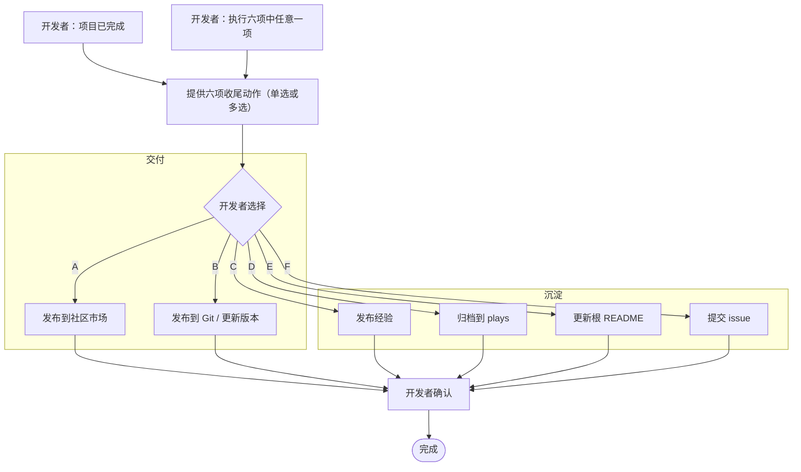

  <strong>简体中文</strong> · <a href="project-completion.md">English</a>

# 项目开发完成流程

当一个项目的开发结束，项目完成流程提供了一个由六项可选动作组成的菜单。本页是唯一权威索引：说明触发时机、按用途分组的六项动作、共同的安全与同意门槛，以及共享的发布属性。

完成流程不是固定流水线，也不与发布绑定。开发者选择其中任意一项或多项，顺序不限。每项动作只有在开发者确认后才会执行。

六项动作**全部可选**——没有任何一项是强制的。README 更新（动作 E）是六项之一，选中时执行；它也默认伴随归档（动作 D）一起进行，因此归档项目时会顺带刷新 README。

## 何时提供完成流程

出现以下任一信号时，就提供这片选项菜单：

- 开发者说项目已完成（开发结束）。
- 开发者要求直接执行这六项动作中的任意一项。

两种情况下都提醒开发者：下面六项收尾动作可用，每项都可单独选择或组合选择。

## 六项动作

动作用途分组。交付类动作发布项目结果；沉淀类动作捕获文档与开放协作。

### 交付

| 编号 | 动作 | 详情 |
| --- | --- | --- |
| A | 发布到社区市场 | [动作 A](#action-a) |
| B | 发布到 Git 并更新版本 | [动作 B](#action-b) |

### 沉淀

| 编号 | 动作 | 详情 |
| --- | --- | --- |
| C | 发布经验 | [动作 C](#action-c) |
| D | 归档应用到 plays | [动作 D](#action-d) |
| E | 更新根 README | [动作 E](#action-e) |
| F | 提交 issue | [动作 F](#action-f) |

每项动作都写明驱动它的仓库 skill 或权威文档。这里不重写 skill；动作小节引用它们。

## 触发流程

## 共享发布属性

发布到社区时会采集一组项目属性。把这些作为共享 profile，让 C、D、E、F 都能复用同一份值，而不是重复采集：

- 应用名（lowercase-kebab-case）。
- 双语发布标题与简介。
- 封面图像（`<app-name>-cover.<webp|png|jpg>`，≤10 MiB）。
- 源码地址：开发者提交的 HTTPS Git 页，从 `git remote -v` 解析。
- 固件路径 / 合并 `.bin`。

执行时若 profile 已采集则直接复用；若未采集，则通过对应动作 skill 获取这些值。

## 发布后的真机验证

当交付动作（A 或 B）产出了合并完整构建时，在把项目视为完成前先到真机验证。下载该 release 的合并完整固件（`FoloToy-AI-Passport-full.bin`，从 `0x0` 烧录的完整构建），烧录到设备并确认正常运行。不要把一次成功的构建或上传当作硬件验证：这一步证明 release 实际指向的产物能在真实硬件上启动并工作。产物来自 release 资产（CI/CD 的 `full.bin`），或对无 CI 产物的 Git release，来自开发者本地构建的 `full.bin`。若不能运行，先停下修复，再继续收口。产物与烧录见 [`CI-build-and-release.md`](../ci/CI-build-and-release.zh_CN.md)。

## 共同的安全与同意门槛

每项动作都遵守下面这些不可协商的规则：

- 开始前确认同意；本工作涉及项目私有内容。
- 任何提交前确认已有可用的 GitHub 通道（GitHub MCP、GitHub skill 或 `gh`）；若都不可用，则生成内容供手动粘贴并停止。
- 在开发者审查并授权之前，不提交（issue 或 PR）。
- 不在开发者当前分支上提交或修改；变更放在独立分支或 worktree 上承载。
- 永远不包含凭证、设备 QR 密钥、私密设备链接、个人数据或未脱敏日志。

## 动作 A：发布到社区市场

本动作把固件发布到 AI Passport 社区市场。工作流由官方 publisher skill 驱动；运行一次提示词会让助手从官方 bundle 安装该 skill，仓库内不提交任何东西。

### 输入

- 从 `0x0` 烧录的单个合并 ESP `.bin`，由 `./tools/validate.sh --firmware` 构建并验证（这会生成并验证合并完整镜像；不要用只用于日常增量编译的 `idf.py build` 代替）。
- 一张有代表性的封面图像（JPEG / PNG / WebP，≤10 MiB）。
- 固件仓库的公开 HTTPS Git 页，从 `git remote -v` 解析。

### 输出

这些值构成其他收尾动作复用的 [共享发布属性](#published-profile)：

- 应用名。
- 双语发布标题与简介。
- 封面图像。
- 源码地址。

### 步骤

1. 从官方 bundle 安装 publisher skill。
2. 检查项目并准备双语标题与简介。
3. 解析 HTTPS Git 源码。
4. 准备并验证封面。
5. 通过官方站点授权。
6. 上传前预览每个字段并取得明确批准。
7. 上传并报告响应。

### 安全与边界

- 只上传到 `https://ai-passport.folotoy.cn`。发布与更新是外部变更。
- 未经开发者确认的验证、草拟和预览不构成上传授权。
- 助手永不请求、接收或存储授权凭证。
- 被拒绝的上传永不自动重试；先报告响应并与开发者一起定位原因。

相关：[社区发布参考](publish-to-community.zh_CN.md)。

## 动作 B：发布到 Git 并更新版本

本动作把固件或代码发布到版本控制仓库，并在需要时更新 GitHub/GitLab release。这是 Git 发布路径，不是社区路径——先确认目的。

每一步都是需要授权的外部变更，须与开发者分开逐一确认——不要把一次事前确认视为覆盖 commit、push、tag 和 release。

### 步骤

1. 提交变更并推送到 fork（`origin`）——分开确认。
2. 创建并推送 tag 以触发 release 工作流——分开确认。
3. 让 tagged 构建产生合并固件 `.bin`。
4. 用产物创建或更新 GitHub/GitLab release——分开确认。工作流把 release 标题默认设为版本/tag 名；release 发布后，把它改成项目特性名加版本号。
5. 用英文写 release notes（项目双语时另附简体中文版），覆盖新增内容、如何构建、如何使用。
6. 在真机验证发布的完整构建（见 [发布后真机验证](#post-release-hardware-verification)）。

### 规则

- 遵守仓库提交与 PR 规则（[commit-and-pr.zh_CN.md](../../contribution/commit-and-pr.zh_CN.md)）。
- 遵守 fork 工作流（[fork-guide.zh_CN.md](../../fork-guide.zh_CN.md)）。
- tag 触发的构建运行 `build-firmware.yml`，它只为 tag 发布 release。见 [CI-build-and-release.zh_CN.md](../ci/CI-build-and-release.zh_CN.md)。
- 日常编译优先用 `idf.py build`（快、增量）；仅当需要合并、字节校验的 `0x0` 完整镜像时才用 `./tools/validate.sh --firmware`，例如发布或交付前。
- 工作流用默认标题（版本/tag 名）创建 release（来自 `softprops/action-gh-release` 与 `github.ref_name`）。release 发布后，把标题改成项目特性名加版本号——例如 `Voice Keychain v1.2.0`。版本是 tag，特性名是应用的 发布名，来自共享 [发布属性](#published-profile)。
- release notes 必须向没读过仓库的用户解释构建：新增内容、如何构建、如何使用。

相关：[tagged 固件构建与发布](../ci/CI-build-and-release.zh_CN.md)。

## 动作 C：发布经验

本动作从一次发布中捕获可复用、持久化的开发经验，并作为文档 PR 提交到上游项目。工作流由 `experience-pr` skill 驱动。

### 重点

捕获 fork 相对上游的 `docs/` 差异——开发者在本 fork 上创建或改动的文档。只提取持久、可复用的学习点：

- fork 记录或改动、而上游没有的内容及其原因。
- 硬件事实、接口、时序、资源预算或失败行为。
- 构建、验证或发布流程的改进。
- 能应用到下次发布的泛化结论。

### 路由

提交前决定每个学习点的归属：

- **可复用、通用经验交给上游**——对任何用户都有益、属于上游基线的学习点，作为 PR 提交到上游项目。
- **fork 专属定制留在 fork**——产品定制内容、fork 私有业务规则或 fork 专属素材。不提交上游，就地记录。

### 步骤

1. 确认同意与可用 GitHub 通道（GitHub MCP、GitHub skill 或 `gh`）。
2. 对比 fork 与上游，找出 `docs/` 差异。
3. 提取并路由可复用经验。
4. 在 `docs/reference/<username>/` 下写单个条目（一个 `.md` 文件加它的 `.zh_CN.md`），命名遵循 lowercase-kebab-case，并在经验索引中链接它。
5. 提交变更供审查，然后在明确批准后才 commit、push 到 fork 并开 PR。

相关：[经验索引](../../reference/README.zh_CN.md)、[fork 工作流](../../fork-guide.zh_CN.md)。

## 动作 D：归档应用到 plays

本动作把已发布应用归档到上游 `plays/` 应用归档，使其在仓库内可被发现、供后续查询。工作流由 `plays-archive` skill 驱动。

### 输入

- 应用名（lowercase-kebab-case）。
- [发布属性](#published-profile)：双语标题与简介，以及源码地址。

### 步骤

1. 确认同意与可用 GitHub 通道（GitHub MCP、GitHub skill 或 `gh`）。
2. 在 `plays/<username>/<app-name>/` 下生成双语 AI 功能摘要（`README.md` / `.zh_CN.md`），存在根 README 时合并它。
3. 记录发布元数据——双语标题与简介、源码地址——其中以文件名和格式记录封面图，但**不提交封面图本身**。归档仅文本。
4. 独立处理每个分支的根 README（必需 README 同步见 [动作 E](#action-e)）。
5. 只在独立分支提交摘要；不存储固件 `.bin` 或封面图。
6. 审查后向上游项目开归档 PR。

### 安全

- 归档中永不存储合并固件 `.bin` 或封面图；归档仅文本，两者都是构建/发布产物。
- 未经开发者审查与同意不提交。

相关：[应用归档约定](../../reference/README.zh_CN.md)、[`plays-archive` skill](../../../skills/plays-archive/SKILL.zh_CN.md)。

## 动作 E：更新根 README

本动作在相关分支上更新 fork 的根 `README.md`，以反映新发布或新归档的应用。

根 README 路径刻意留给 fork 所有者。上游的项目概览在 `docs/README.md`；fork 可以加自己的根 README 说明产品，而不替换上游文档。

fork 让 `main` 与上游同步、把产品工作放在 `feature/*` 分支上，因此根 README 存在于多个分支。独立处理每个分支的根 README——`main` 的 README 与 `feature/*` 分支的 README 是不同决定。

### 何时推荐

README 更新与其他五项一样是**可选**动作，也是归档的默认伴随动作：当应用归档到 `plays/`（动作 D）时，README 同步随该动作运行。归档本身可选——开发者可拒绝——但每当项目完成，都应在承载分支与 fork `main` 上刷新 README，让应用在它被开发的地方被登记。

### 规则

- 只碰 fork 拥有的根 README（`README.md` / `README.zh_CN.md`）；不改 `docs/README.md` 的上游项目概览。
- 检查每个相关分支（`main` 与当前 `feature/*` 分支）的根 README，而不只是分支其一。
- fork `main` 的根 README 是 **fork 项目的目录**：它**完整包含**各项目自身 README 的内容——应用做什么、怎么用的完整描述（交互、模式、按键、持久化与说明）——而不是一行简介加分支链接。内容取自承载分支的 README。
- fork 根 README 与承载分支的根 README 都是 fork 拥有内容，直接提交（merge）而非开 PR；只有意图送上游时才开 PR。
- 遵守仓库语言规则：默认 `.md` 用英文、配对的 `.zh_CN.md` 用简体中文，同一变更里对齐。

### 步骤

1. 确认同意与可用 GitHub 通道（GitHub MCP、GitHub skill 或 `gh`）。
2. 在承载 `feature/*` 分支：若双语 README 对缺失则创建，或更新以添加/刷新应用自身的描述。
3. 在 fork `main`：更新根 README 对，让已发布应用可从仓库落地页被发现，完整包含承载分支 README 的内容。
4. 直接把 README 更新提交到分支 / fork `main`（fork 拥有内容）；除非是上游变更，否则不开 PR。

相关：[fork 工作流与根 README 归属](../../fork-guide.zh_CN.md)、[`plays-archive` skill](../../../skills/plays-archive/SKILL.zh_CN.md)、[文档规范](../../contribution/doc-conventions.zh_CN.md)。

## 动作 F：提交 issue

本动作收集发布者的改进点，作为 feature request issue 提交到上游项目。工作流由 `issue-suggestions` skill 驱动。issue 提交到上游项目，而非 fork。

### 步骤

1. 确认同意与可用 GitHub 通道（GitHub MCP、GitHub skill 或 `gh`）。
2. 收集开发或发布过程中遇到的改进点。
3. 去重、丢弃无效或已解决的点，并按影响领域归类。
4. 与现有 issue 与 PR 匹配，不创建重复项。
5. 用上游 issue 模板起草 feature request。
6. 提交前展示草稿并等待明确批准。
7. 通过第一个可用 GitHub 通道提交，并读回创建的 issue 确认。

### 安全

- 永不包含凭证、设备 QR 秘密、私密设备链接、个人数据或未脱敏日志。
- 安全漏洞走 `.github/SECURITY.md`，不是公开 issue。

相关：[提交 issue 参考](file-issues.zh_CN.md)、[`issue-suggestions` skill](../../../skills/issue-suggestions/SKILL.zh_CN.md)、[issue 模板](../../../.github/ISSUE_TEMPLATE/feature_request.yml)。

## 相关文档

- 固件发布：[publish-to-community.zh_CN.md](publish-to-community.zh_CN.md)
- Fork 工作流与根 README 归属：[fork-guide.zh_CN.md](../../fork-guide.zh_CN.md)
- 提交与 PR 规则：[commit-and-pr.zh_CN.md](../../contribution/commit-and-pr.zh_CN.md)
